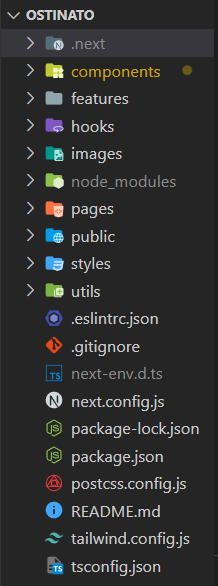
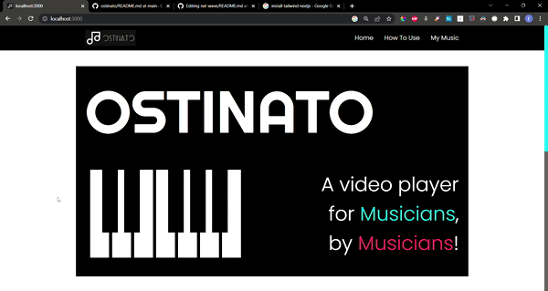
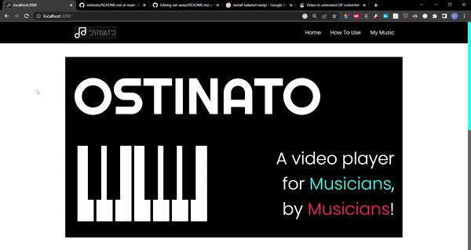
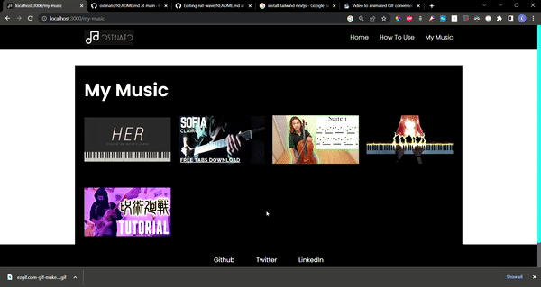
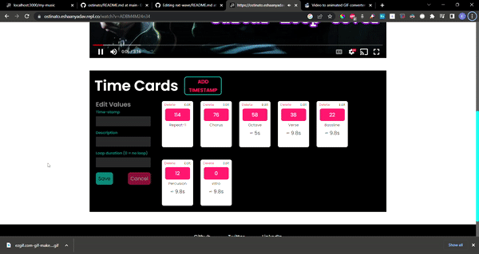
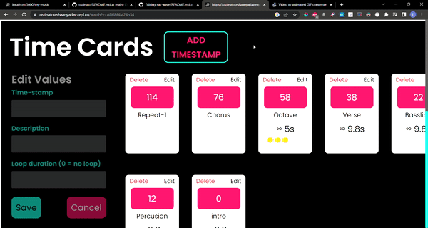

Find the website [here](https://ostinato.eshaanyadav.repl.co/my-music)  
# OSTINATO
Ever tried learning a song by playing along, and getting frustrated by re-playing again and again. Presenting [OSTINATO](https://ostinato.eshaanyadav.repl.co/my-music). 
<br/>
A video player for musicians, built by musicians!
<br/>
<br/>
This project was built using NextJS, TailwindCSS. Enterprise-friendly practices were utilized to build this, keeping in mind, the robustness, type checks, and fool-proof design.

## Initialisation
We initialise the application using NextJS and TailwindCSS, with TypeScript configuration. This was achieved using the following command 

```bash
npx create-next-app@latest --ts
```

After this Tailwind was added as follows:

```bash
npm install -D tailwindcss postcss autoprefixer
# followed by
npx tailwindcss init -p
```

## Development

### Directory Structure


<br/>
###### *Fig 1. Directory structure for the web app.*
<br/>

Within the NextJS App, several folders were created.

- **Components** include reusable single components, that can be called throughout the project.
- **Features** include multiple components and JSX elements to create compound sections and features.
- **Hooks** consist of user-defined hooks built by the user.
- **Functions** include API functions and other functions as well.
- **Types** include the type interface of the data retrieved using the API.

### Typescript FTW

- Typescript allows us to check the legitimacy of the code that we write.
- Every single component has a type/interface attached, so if the developer skips over the essential props, or assigns unexpected values, it will throw errors.
- This helps us to write foolproof and robust code.

## Features

### Landing Page
It was built by first initialising a layout component, that provided a basic view with Navabar and Footer. It then asks for children components, and displays the page with the provided props.


<br/>
###### *Fig 2. The Landing Page*
<br/>

### Playable Piano
A simple easter egg just for fun.

<br/>
###### *Fig 3. Piano keys emit sound on click*
<br/>

### My Music page
The website stores all the visited pages/video urls into localstorage and hence, can retrieve previous tutorials that the user might want to revisit.

<br/>
###### *Fig 4. My Music displays all the videos visited*
<br/>

### Instant video querying
User doesn't require any search box or input to access the media in the player. The user can directly access the player by copying the video URL onto the youtube URL and hence redirecting the video throught the player.

<br/>
###### *Fig 5. URL based video query*
<br/>


### TimeStamp Edit
CRUD operations can be performed on any timestamp. These can be created as loops or simple timestamps, and can be deleted or sorted.

<br/>
###### *Fig 6. TimeStamps*
<br/>

### TimeStamp Looping
The video loops till the duration of the selected timestamp

<br/>
###### *Fig 6. looping*
<br/>


## NextJS setup
First, run the development server:

```bash
npm run dev
# or
yarn dev
```

Open [http://localhost:3000](http://localhost:3000) with your browser to see the result.

You can start editing the page by modifying `pages/index.tsx`. The page auto-updates as you edit the file.

[API routes](https://nextjs.org/docs/api-routes/introduction) can be accessed on [http://localhost:3000/api/hello](http://localhost:3000/api/hello). This endpoint can be edited in `pages/api/hello.ts`.

The `pages/api` directory is mapped to `/api/*`. Files in this directory are treated as [API routes](https://nextjs.org/docs/api-routes/introduction) instead of React pages.

## Learn More

To learn more about Next.js, take a look at the following resources:

- [Next.js Documentation](https://nextjs.org/docs) - learn about Next.js features and API.
- [Learn Next.js](https://nextjs.org/learn) - an interactive Next.js tutorial.

You can check out [the Next.js GitHub repository](https://github.com/vercel/next.js/) - your feedback and contributions are welcome!

## Deploy on Vercel

The easiest way to deploy your Next.js app is to use the [Vercel Platform](https://vercel.com/new?utm_medium=default-template&filter=next.js&utm_source=create-next-app&utm_campaign=create-next-app-readme) from the creators of Next.js.

Check out our [Next.js deployment documentation](https://nextjs.org/docs/deployment) for more details.
